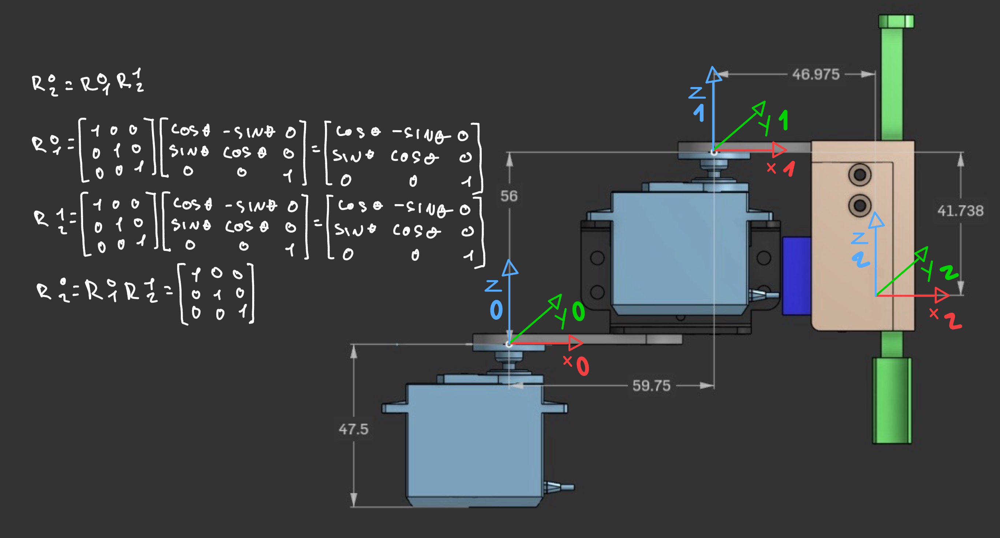
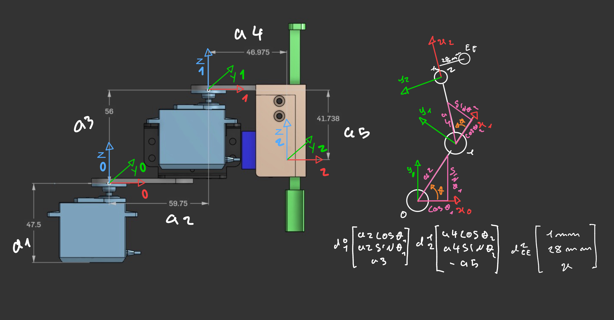
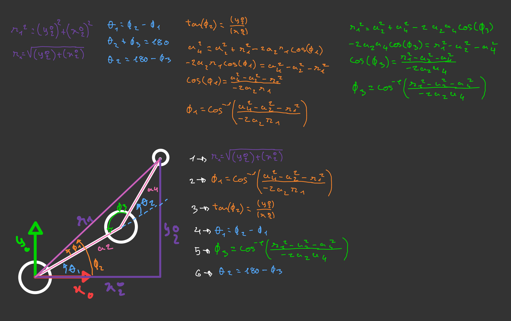

# Robot Analysis

## Rotation Matrices

Here is the analysis of the rotation matrices between all the joints from the base to end effector.<br>
<br>


## Displacement Vectors

<br>

## Inverse Kinematics

<br>


The file ```analysis.py``` confirms the calculations on the image and will serve as a way to confirm the truth on the robot movements