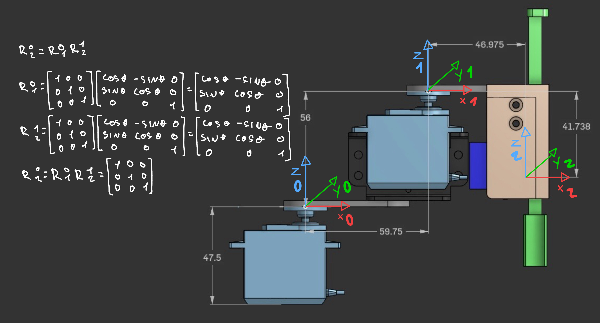

# Rotation Matrices analysis

Here I make the analysis of the rotation matrices between all the joints from the base to end effector.<br>
<br>

The file ```rotation_matrices.py``` confirms the calculations on the image and will serve as a way to confirm the truth on the robot movements